# Hands on Lab 4 - DocumentDb #

## 1. Overview ##

DocumentDB is a NoSQL document database service designed for modern mobile and web applications. 

DocumentDB delivers consistently fast reads and writes, schema flexibility, and the ability to easily scale a database up and down on demand. 

DocumentDB enables complex ad hoc queries using the SQL dialect, supports well defined consistency levels, and offers JavaScript language integrated, multi-document transaction processing using the familiar programming model of stored procedures, triggers, and UDFs. 

DocumentDB natively supports JSON documents enabling easy iteration of application schema.  

The lab will detail how to deploy a number of solutions to Azure which perform the following functions.

* Deploy a simple WebJob to pull data from the Event Hub and push into DocumentDb
* Write a simple aggregated query to display the data using an ASP.NET website with Highcharts.

## Pre-requisites ##

 - Event Hub created as part of earlier lab (HOL 1)
 - Event Hub populated with data (DeviceSender HOL 1)

## 2. Create DocumentDB instance ##

1. 	Navigate to the Microsoft Azure portal [https://portal.azure.com/](https://portal.azure.com/)
2. 	Click New -> Everything -> Data + Analytics and select DocumentDB.

	

3. 	Click Create in the new blade.

	

4. 	Review the options in the New DocumentDB blade. In the **Id** box, enter a name to identify the DocumentDB account. This value becomes the host name within the URI. 
	- The Id may contain only lowercase letters, numbers, and the '-' character, and must be between 3 and 50 characters.
	- Note that documents.azure.com is appended to the endpoint name you choose, the result of which will become your DocumentDB account endpoint.    

	

5. 	Click on **Resource Group** to choose the resource group created in Hands on Lab 1.  Set the location to the same geographic location used for the storage account and previous labs.  

6. 	Once the new DocumentDB account options are configured, click **Create** in the lower left corner of the blade. It can take a few minutes for the DocumentDB account to be created. To check the provisioning status monitor the progress on the Startboard.  

	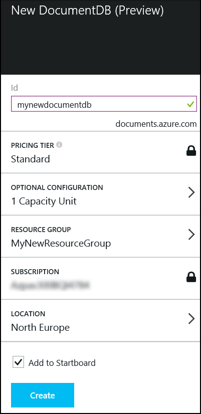

7. 	The DocumentDB blade appears after the DocumentDB account is provisioned.  The new DocumentDB account blade is used for general administration.  

	

8. 	An account may have multiple DocumentDB databases.  Click **Add Database** from the top menu of the DocumentDB account blade to create the first database. 

	

9. 	Enter the database name and click Ok.  The Add Database blade will close.

	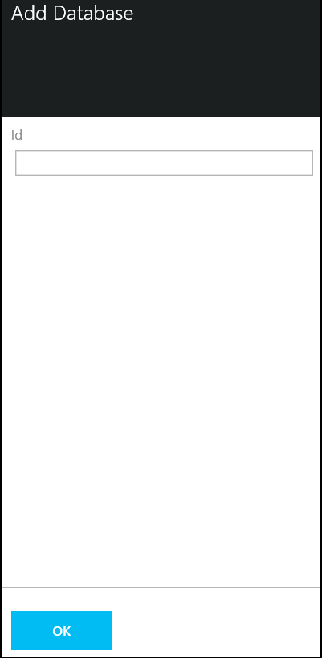

10. Scroll down the DocumentDB account blade to locate the Databases section.

	

11. Click on the newly create DocumentDB database to view the properities of the new database in the Database blade.  

	

12. Each database will support multiple collections.  A collection is a container of JSON documents and the associated JavaScript application logic.  Click **Add Collection** at the top of the blade.  

	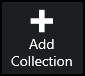

13. Enter the name of the new collection in the Add Collection blade.  Click OK. Close the Database blade by clicking the close in the upper right corner of the blade. 

	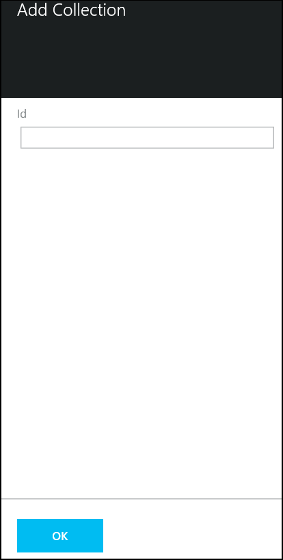


## 3. Document Explorer ##

1. 	Navigate to the DocumentDB Account blade.

2. 	Scroll down to locate the **Developer Tools** section.  Click on **Document Explorer**.   

	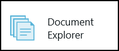

3. 	Document Explorer is a lightweight Azure portal tool to add, create, and query documents in a DocumentDB database.  Note that Document Explorer defaulted to the database and collection created in the previous steps.  

	

4. 	Notice that Document Explorer supports both Create Document and Add Document in the upper menu.  **Add Document** is used to upload existing json documents to the database.  For this exersize, click **Create Document** to enter a new document.

	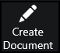

5. 	Replace the text with the following to insert a simple document with an ID and a single property.  Click Save to put the document in the collection. 

	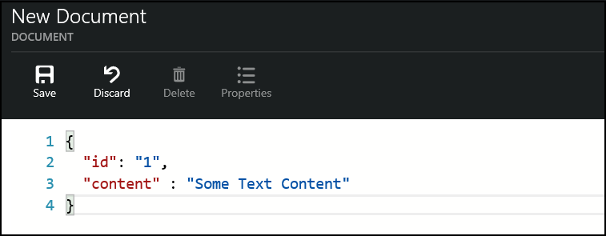

6. 	The Document Explorer pane will be updated and show the new document, you can edit the document from here if further changes need to be made. 

	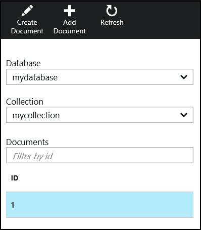

## 4. Create Azure Website ##

Azure Websites is a fully managed Platform-as-a-Service (PaaS) that enables you to build, deploy and scale enterprise-grade web Apps quickly. 

This allows you to focus on your application code, Azure Websites enable security and scalability for your web applications "out of the box".

Time to complete: **10 minutes**

1. 	Navigate to the Microsoft Azure portal [https://portal.azure.com/](https://portal.azure.com/).

2. 	Select New -> Everything -> Web App and select.

	

3. 	Click Create in the new pane.

	

3. 	Enter a name for the website and select the Resource Group created in the previous lab.

	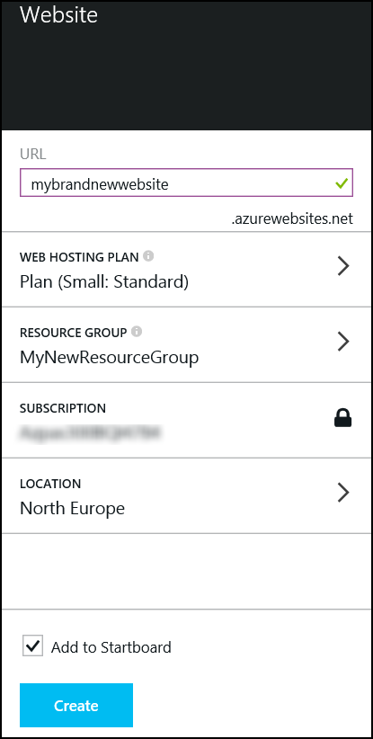

4. 	Click Create and wait for the job to complete.

5. 	Once the website creation has finished the following pane will be displayed.

	

6. 	In a browser navigate to the website i.e. http://mybrandnewwebsite.azurewebsites.net/ a placeholder page should be displayed.

	


## 5. Configuring the WebJob ##

1.	Start Visual Studio from the taskbar and open the solution file **C:\CloudDataCamp\DataAnalyticsCourse\src\DocumentDBWebJob\DocumentDBWebJob.sln**.

3.	Locate App.config and locate the <appSettings> section. 
	- Update ServiceBus.ConnectionString  with the settings from the Event Hub configureation in the Hands on Lab 1.  If you did not save these values in a text file on the desktop, the Service Bus Namespace, Policy Name, and Policy Key are available on the [Management Portal](https://manage.windowsazure.com "Management Portal"). 
	- Update ServiceBus.Path with the name of the Event Hub configured in the first lab.

	```xml
	<appSettings>
    	<add key="ServiceBus.ConnectionString" value="Endpoint=sb://<sbNamespace>.servicebus.windows.net/;SharedAccessKeyName=<policyname>;SharedAccessKey=<policyKey>" />
    	<add key="ServiceBus.Path" value="\<hubName>" />
    	<add key="ServiceBus.ConsumerGroup" value="$Default" />
    	<add key="ServiceBus.partitions" value="8" />
    	<add key="DocumentServiceEndpoint" value="https://<documentdbName>.documents.azure.com:443/" />
    	<add key="DocumentKey" value="<key>" />
    	<add key="DocumentDatabase" value="<databasename>" />
    	<add key="DocumentCollection" value="<collection>" />
    </appSettings>
    ```

4.	To determine the configuration settings for DocumentDB, navigate to [Azure Preview Portal](https://portal.azure.com/ "Azure Preview Portal")

5.	Select the documentDB instance created in a previous lab.

6.	Select the Keys button.

	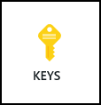

7.	Copy the URI and Primary key, substitute as appropriate in <appSettings>.

	

8.	Set DocumentDatabase/DocumentCollection as appropriate.


## 6. Exploring the solution ##

The main artefacts of this solution are program.cs, DocumentDBWriter.cs and Document.cs

### program.cs ###

The purpose of this class is to provide the main entry point and monitor an Event Hub for messages.

It first retrieves a reference to a Service Bus namespace

```c#
NamespaceManager manager = NamespaceManager.CreateFromConnectionString(ConfigurationManager.AppSettings["ServiceBus.ConnectionString"] + ";TransportType=Amqp");
```

Creates a Consumer Group if it does not already exist

```c#
ConsumerGroupDescription description = new ConsumerGroupDescription(ConfigurationManager.AppSettings["ServiceBus.Path"], ConfigurationManager.AppSettings["ServiceBus.ConsumerGroup"]);
manager.CreateConsumerGroupIfNotExists(description);
```

Gets a reference to a consumer group so we can perform read operations
	
```c#
var factory = MessagingFactory.CreateFromConnectionString(ConfigurationManager.AppSettings["ServiceBus.ConnectionString"] + ";TransportType=Amqp");
var client = factory.CreateEventHubClient(ConfigurationManager.AppSettings["ServiceBus.Path"]);
var group = client.GetConsumerGroup(ConfigurationManager.AppSettings["ServiceBus.ConsumerGroup"]);
```

It will execute continuously

```c#
while (true)
    {
```

Spawning a task for each Event Hub partition

```c#
Task.WaitAll(client.GetRuntimeInformation().PartitionIds.Select(id => Task.Run(() =>
	{
```

Each task will create a reciever, from which event hub messages will be read

```c#
var receiver = @group.CreateReceiver(id);
```

And will continuously read from the Event Hub partition

```c#
while (true)
    {
       try
        {
            //read the message
            var message = receiver.Receive();

            if (message == null)
                continue;

            var body = Encoding.UTF8.GetString(message.GetBytes());

            if (body == null)
                continue;
```

It will determine the type of message recieved

```c#
var type = MessageType.None;

switch (message.PartitionKey.ToLower())
    {
        case "energy":
            type = MessageType.Energy;
            break;
        case "temperature":
            type = MessageType.Temperature;
            break;
        case "humidity":
            type = MessageType.Humidity;
            break;
        case "light":
            type = MessageType.Light;
            break;
    }

    if (type == MessageType.None)
        continue;
```

And passes this to the DocumentDBWriter to push to DocumentDB

```c#
var writer = new DocumentDBWriter();
var task = writer.WriteDocument(type, body);
```

### DocumentDBWriter ###

The purpose of this class is to create new documents in DocumentDB, it provides a single method WriteDocument

This creates a DocumentDB client

```c#
var client = new DocumentClient(new Uri(ConfigurationManager.AppSettings["DocumentServiceEndpoint"]), ConfigurationManager.AppSettings["DocumentKey"]);
```

Gets a reference to the database

```c#
var dbName = ConfigurationManager.AppSettings["DocumentDatabase"];
var database = client.CreateDatabaseQuery().Where(db => db.Id == dbName).AsEnumerable().FirstOrDefault() ??
               await client.CreateDatabaseAsync(new Database{ Id = dbName});
```

And the collection

```c#
var docCollection = ConfigurationManager.AppSettings["DocumentCollection"];
var documentCollection = client.CreateDocumentCollectionQuery(database.CollectionsLink).Where(c => c.Id == docCollection).AsEnumerable().FirstOrDefault() ??
        await client.CreateDocumentCollectionAsync(database.CollectionsLink, new DocumentCollection { Id = docCollection });
```

Generates a unique identifier for the document

```c#
var id = Guid.NewGuid().ToString();
```

And will generate a document with an appropriate structure depending on the type of message processed

```c#
switch (type)
    {
        case MessageType.Energy:
            var energyDoc = JsonConvert.DeserializeObject<EnergyDocument>(jsonString);
            energyDoc.id = id;
            response = (await client.CreateDocumentAsync(documentCollection.DocumentsLink, energyDoc)).StatusCode;
            break;
        case MessageType.Humidity:
            var humidityDoc = JsonConvert.DeserializeObject<HumidityDocument>(jsonString);
            humidityDoc.id = id;
            response = (await client.CreateDocumentAsync(documentCollection.DocumentsLink, humidityDoc)).StatusCode;
            break;
        case MessageType.Light:
            var lightDoc = JsonConvert.DeserializeObject<LightDocument>(jsonString);
            lightDoc.id = id;
            response = (await client.CreateDocumentAsync(documentCollection.DocumentsLink, lightDoc)).StatusCode;
            break;
        case MessageType.Temperature:
            var tempDoc = JsonConvert.DeserializeObject<TemperatureDocument>(jsonString);
            tempDoc.id = id;
            response = (await client.CreateDocumentAsync(documentCollection.DocumentsLink, tempDoc)).StatusCode;
            break;
   }
```

 
## 7. Deploy the WebJob ##

1. 	In solution Explorer, right click the project and choose Publish as Azure WebJob.  The following dialog will be displayed, click Ok.

	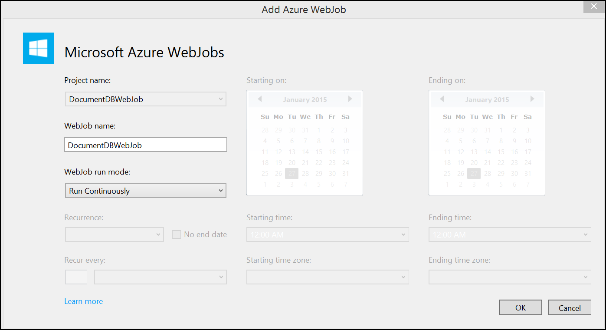

2. 	The following dialog will be displayed.

	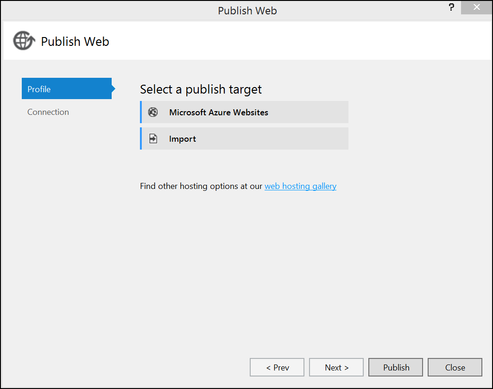

3. 	Choose Option.

	

3. 	Enter your credentials.

	

5. 	Select the website we created in an earlier lab, click Ok.

	

6. 	The default settings will be sufficient, click Publish.

	
 
7. 	Wait for the publish to complete.

8. 	You can track the status of the WebJob by navigating to the [Management Portal](https://manage.windowsazure.com "Management Portal")

9. 	Find the Website and navigate to the WebJobs tab.  

	

10.	The logs column provides a link where you can track the status of the deployed Web Job.

	


## 8. Configure the Website ##

1. 	Return to Visual Studio and navigate to the project **C:\CloudDataCamp\DataAnalyticsCourse-master\src\DocumentDBWebApp**.  Open the solution file DocumentDBWebApp.sln.

2. 	Locate Web.config and update the <appSettings> section with the DocumentDB settings.  

    ```xml
	<appSettings>
		...
    	<add key="DocumentServiceEndpoint" value="https://<documentdbName>.documents.azure.com:443/" />
    	<add key="DocumentKey" value="<key>" />
    	<add key="DocumentDatabase" value="<databasename>" />
    	<add key="DocumentCollection" value="<collection>" />
    </appSettings>
	```


## 9. Exploring the solution ##

This project is a ASP.NET MVC application.  The following will show how we read from DocumentDB, DocumentDBDataReader.cs is the class responsible for this.

### DocumentDBDataReader.cs ###

Provides a constructor DocumentDBDataReader

Creates a reference to the DocumentDB, database and collection

```c#
	var dict = new Dictionary<HighchartsHelper.DocumentTypes, IEnumerable<Document>>();
    _documentClient = new DocumentClient(new Uri(ConfigurationManager.AppSettings["DocumentServiceEndpoint"]), ConfigurationManager.AppSettings["DocumentKey"]);

    _database = _documentClient.CreateDatabaseQuery().Where(db => db.Id == ConfigurationManager.AppSettings["DocumentDatabase"]).AsEnumerable().FirstOrDefault();

    if (_database == null)
        throw new ApplicationException("Error: DocumentDB database does not exist");

    // Check to verify a document collection with the id=FamilyCollection does not exist
    _documentCollection = _documentClient.CreateDocumentCollectionQuery(_database.CollectionsLink).Where(c => c.Id == ConfigurationManager.AppSettings["DocumentCollection"]).AsEnumerable().FirstOrDefault();

    if (_documentCollection == null)
        throw new ApplicationException("Error: DocumentDB collection does not exist");
```

Creates a User Defined Function in DocumentDB, this allows us to search for a subset of documents where a particular property exists.

```c#
	_documentClient.CreateUserDefinedFunctionAsync(_documentCollection.SelfLink, new UserDefinedFunction
    {
        Id = "ISDEFINED",
        Body = @"function ISDEFINED(doc, prop) {
                return doc[prop] !== undefined;
            }"
    });  
```

A number of other methods exist that retrieve a specific subset of documents 

```c#
	public IEnumerable<EnergyDocument> GetEnergyData()
    {
        return _documentClient.CreateDocumentQuery<EnergyDocument>(_documentCollection.DocumentsLink, String.Format("SELECT * FROM {0} t WHERE ISDEFINED(t, 'Kwh')",
            ConfigurationManager.AppSettings["DocumentCollection"])).ToList();
    }

    public IEnumerable<TemperatureDocument> GetTemperatureData()
    {
        return _documentClient.CreateDocumentQuery<TemperatureDocument>(_documentCollection.DocumentsLink, String.Format("SELECT * FROM {0} t WHERE ISDEFINED(t, 'Temperature')",
            ConfigurationManager.AppSettings["DocumentCollection"])).ToList();
    }

    public IEnumerable<HumidityDocument> GetHumidityData()
    {
        return _documentClient.CreateDocumentQuery<HumidityDocument>(_documentCollection.DocumentsLink, String.Format("SELECT * FROM {0} t WHERE ISDEFINED(t, 'Humidity')",
            ConfigurationManager.AppSettings["DocumentCollection"])).ToList();
        
    }

    public IEnumerable<LightDocument> GetLightData()
    {
        return _documentClient.CreateDocumentQuery<LightDocument>(_documentCollection.DocumentsLink, String.Format("SELECT * FROM {0} t WHERE ISDEFINED(t, 'Lumens')",
            ConfigurationManager.AppSettings["DocumentCollection"])).ToList();
    }
```

These are the queries that are performed

```SQL
	SELECT * FROM mycollection t WHERE ISDEFINED(t, 'Kwh')
	SELECT * FROM mycollection t WHERE ISDEFINED(t, 'Temperature')
	SELECT * FROM mycollection t WHERE ISDEFINED(t, 'Humidity')
	SELECT * FROM mycollection t WHERE ISDEFINED(t, 'Lumens')
```

You could try these queries in the DocumentDB Query Explorer.  This can be found in the Microsoft Azure portal [https://portal.azure.com/](https://portal.azure.com/).  Locate the DocumentDB and click the Query Explorer button.

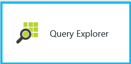

Execute a query in the following blade click **run query**.


The results will be displayed in a new blade.


## 10. Deploy the Website ##

1. 	Return to Visual Studio.  In Solution Explorer, right click project and choose Publish.  The following dialog will be displayed, click Ok.

	 

2. 	Choose option.

	 

3. 	Enter your credentials.

	 

4. 	Select the website we created in an earlier lab, click Ok.

	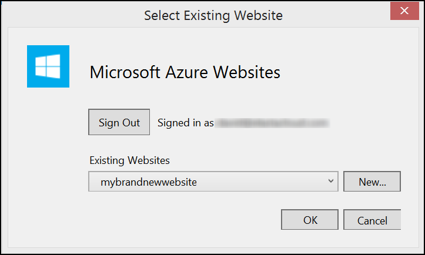 

5. 	The default settings will be sufficient, click Publish.

	 

6. 	Wait for the publish to complete.  Then navigate to the website.  A number of charts will be displayed

	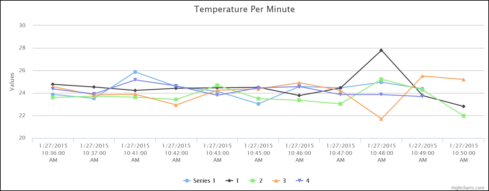 

	 

	 

	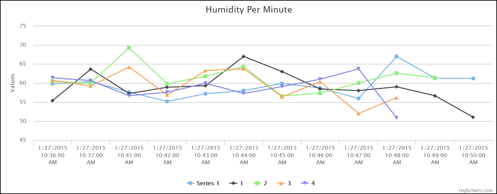 
