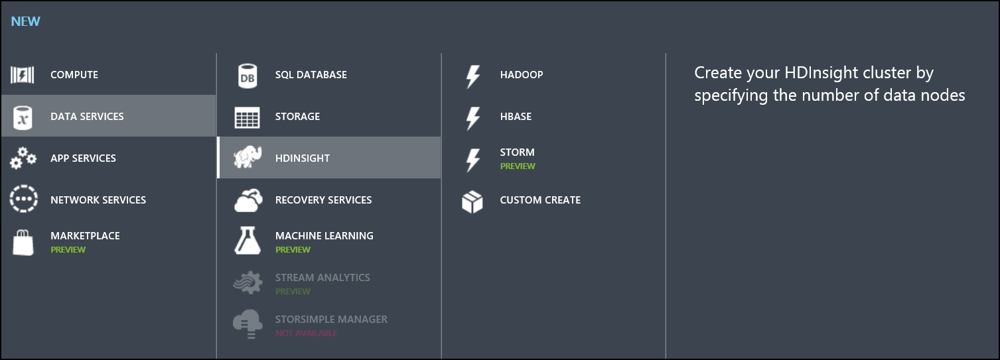
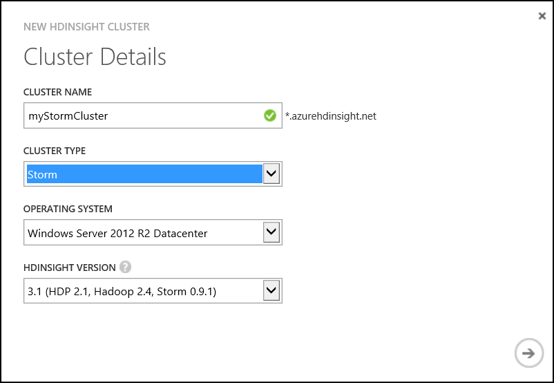
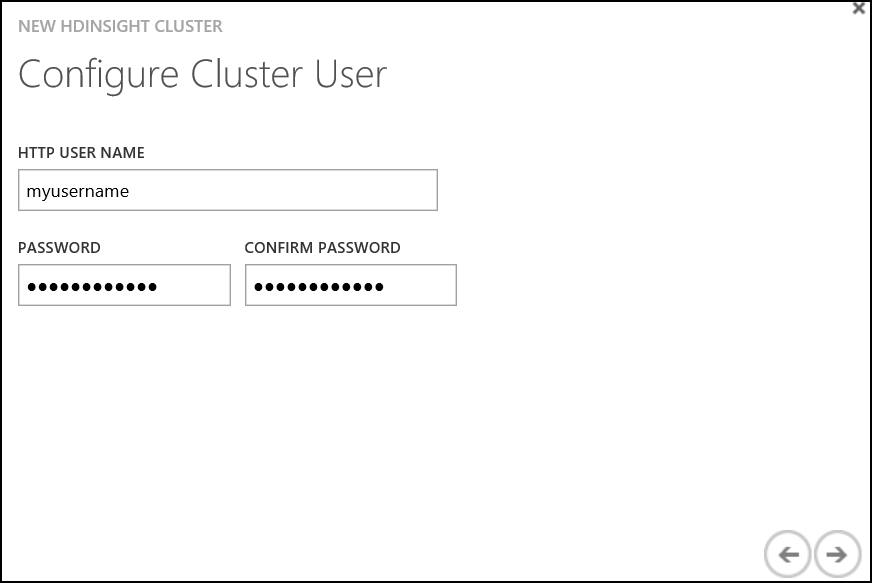

# Hands on Lab 7 - Storm #

## 1. Pre-requisites ##

 - Java IDE such as IntelliJ and/or
 - Maven installed
 - Virtual Network and HBase cluster created as part of Hol 5

## 2. Create Storm Cluster ##

1. Navigate to [https://manage.windowsazure.com](https://manage.windowsazure.com "Management Portal").

2. Click Add New. Choose Data Services -> HDInsight -> Custom Create.

    

3. Edit the Cluster Details.
	- Enter a name for the cluster.  
	- Choose **Storm** as the cluster type. 
	- Do not change the remaining defaults. 

	

4. Edit the Configure Cluster settings.
	- Set the number of nodes to **1**.  
	- Assign the cluster to the virtual network created in the HBase lab. **Verify that you select the VNet and not the locaiton**.

	

5. Configure Cluster User.
	- Set the cluster username and password.  

	

6. Set the storage account. 
	- Create a **new** storage account.
	- Enter a new **unique** storage account name.
	- Enter **storm** for the default container name. 
	Click Next.

	

7. Click Finish.

	


### 3. Configure Storm Cluster ###
Configuration of the Storm application will require connecting to the HBase cluster, the Storm cluster and updating settings in the local course virtual machine.  Take care to connect to the correct environment.  

1. Enable remote desktop for the Storm cluster. Connect to the head node once configuration is complete.

2. Using the **Storm cluster RDP session**, navigate to the %STORM_HOME% directory which is under C:\apps\dist (The folder begins with the prefix storm- ).  

3. Copy the following file to your local machine. 

	%STORM_HOME%\examples\eventhubspout\eventhubs-storm-spout-0.9-jar-with-dependencies.jar
	
	You should be able to copy/paste between the RDP session and your local machine.  Put the file in a convenient location where you can find it for the next step.

4. **On your local machine**, open a cmd prompt and navigate to the directory where the file was saved in the previous step. 

5. Execute the following command to import the jar into the maven repository.  A copy of this script is available on the course virtual machine under **C:\CloudDataCamp\Scripts\1_mvn.txt**.

    ```mvn install:install-file -Dfile=eventhubs-storm-spout-0.9-jar-with-dependencies.jar -DgroupId=com.microsoft.eventhubs -DartifactId=eventhubs-storm-spout -Dversion=0.9 -Dpackaging=jar```

**The next steps will be executed on the HBase cluster.**  Each Azure HDInsight cluster will have a set of ZooKeeper servers in a quorum.  These server properties are needed to configure the Storm topology. 

6. Return to the Azure Management Portal and **connect to the HBase cluster head node**.  

7. Using the **HBase cluster RDP session**, navigate to the %HBASE_HOME% directory which is under **C:\apps\dist** (The folder begins with the prefix hbase- ).

8. Locate the file **hbase-site.xml** in the directory.  Right-click on the file and select Open with > WordPad.

    ```
    $HBASE_HOME%\conf\hbase-site.xml
    ```

9. Locate the hbase.zookeeper.quorum property `<value>` .  Copy the value, it will be pasted to the local machine in the following steps. 

	```xml
    <property>
        <name>hbase.zookeeper.quorum</name>
        <value>zookeeper0.myvnethbasecluster.f2.internal.cloudapp.net,zookeeper1.myvnethbasecluster.f2.internal.cloudapp.net,zookeeper2.myvnethbasecluster.f2.internal.cloudapp.net</value>
    </property>
	```

10. Minimize the HBase RDP session and return to the local machine.  

The following steps will be completed on the course virtual machine, referenced as the **local machine**.

11. On the **local machine**, paste the hbase.zookeeper.quorum value to a text file.

12. Open the **hbase-site.xml** file located in the following directory.  To open, right-click and select Open with > WordPad.

	```
	C:\CloudDataCamp\DataAnalyticsCourse-master\src\StormClusterTopology\src\main\resources\hbase-site.xml
	```

13. Locate and replace the `<value>` for hbase.zookeeper.quorum property in the hbase-site.xml file with the value copied from the HBase cluster.   

14. Locate the file **src\StormClusterTopology\src\main\resources\servicebus.properties**, update the following settings with your Event Hub connection information.  

    ```
    username = <policyName>
    password = <policyKey>
    namespace = <eventHubNamespace>
    eventhub = <eventHubName>
	```

15. On your **local machine** open a **command prompt**.  Navigate to the folder **C:\CloudDataCamp\DataAnalyticsCourse-master\src\StormClusterTopology** .

16. Execute the following command to create a JAR package from your project.

    ```mvn package```

17. Navigate to the directory: 
	**C:\CloudDataCamp\DataAnalyticsCourse-master\src\StormClusterTopology\target\**

18. Copy the file **StormClusterTopology-1.0-SNAPSHOT.jar**.  This will be pasted to the storm cluster. 


These final steps in the section are completed on the **Storm cluster**.  

19. Open the RDP session to the **Storm cluster**.  Naviage to the %STORM_HOME% directory located in C:\apps\dist\.

20. Paste the **StormClusterTopology-1.0-SNAPSHOT.jar**.  You should be able to copy/paste between your local machine and the RDP session.

21. Minimize the Storm cluster and return to the local machine. 


## 4. Exploring the solution ##

A storm topology is composed of spouts, bolts and the topology itself.

Spouts are a source of data in a topology.  They read from an external source and emit the data as a tuple into the topology.

Bolts are the processing units in a storm topology.  They can do anything from filtering, functions, aggregations, joins, talking to databases, and more.

A topology is a graph of spouts and bolts that are connected together and defines the route of data through the system.  A Storm topology is analogous to a MapReduce job. One key difference is that a MapReduce job eventually finishes, whereas a topology runs forever.

For more in-depth information [Storm Documentation](https://storm.apache.org/documentation/Home.html "Storm documentation") is available

In terms of the solution, a single spout that reads from the Azure Event Hub is defined along with a number of bolts.  The defined bolts are;

- JsonParserBolt.java
- DateToMinutesBolt.java
- DeriveKeyBolt.java
- HBaseBolt.java

The storm topology is defined in 

- StormTopologyCluster.java

Each bolt performs a discrete function, and each transforms the data generated by the spout before being pushed to HBase by the HBaseBolt. 


### Basic bolt structure ###

Each bolt inherits from BaseBasicBolt (provided by storm) and implements two methods

- **execute()**
This method performs the actual work of the bolt and contains the bolts logic.

- **declareOutputFields()**
Defines the output "stream" and field names.


### JsonParserBolt.java ###

Processes a tuple generated by the Event Hub spout, parses the JSon string.

```java
    String sentence = input.getString(0);
    Gson gson = new Gson();
```

Determines the type of message, and emits a new object into the topology
 
```java
	if(sentence.toLowerCase().contains("kwh"))
    {
        EnergyMessage msg = gson.fromJson(sentence, EnergyMessage.class);
        collector.emit(new Values(msg.getType(), msg.getDeviceId(), msg.getTimestamp(), msg.getRoomNumber(), msg.getKwh()));
    }else if(sentence.toLowerCase().contains("temperature"))
    {
        TemperatureMessage msg = gson.fromJson(sentence, TemperatureMessage.class);
        collector.emit(new Values(msg.getType(), msg.getDeviceId(), msg.getTimestamp(), msg.getRoomNumber(), msg.getTemperature()));
    }else if(sentence.toLowerCase().contains("lumens"))
    {
        LightMessage msg = gson.fromJson(sentence, LightMessage.class);
        collector.emit(new Values(msg.getType(), msg.getDeviceId(), msg.getTimestamp(), msg.getRoomNumber(), msg.getLumens()));
    }else if(sentence.toLowerCase().contains("humidity"))
    {
        HumidityMessage msg = gson.fromJson(sentence, HumidityMessage.class);
        collector.emit("readings", new Values(msg.getType(), msg.getDeviceId(), msg.getTimestamp(), msg.getRoomNumber(), msg.getHumidity()));
    }
```


### DateToMinutesBolt.java ###

Extracts the timestamp from the tuple
    
```java
	String timestamp = input.getStringByField("timestamp");
```

Parses the data to effectivly strips seconds and milliseconds from the value.

```java
	timestamp = DateTime.parse(timestamp).toString("yyyy-MM-dd'T'hh:mm") + ":00.0000000Z";
```

Emits all the old values and the new timestamp value

```java
	collector.emit("readings", new Values(input.getStringByField("messagetype"), input.getStringByField("deviceId"), timestamp, input.getIntegerByField("roomNumber"), input.getFloatByField("reading")));
```


### DeriveKeyBolt.java ###

Transforms the data by deriving a key from the incoming data

```java
	String key = String.format("%s,%s,%d", input.getStringByField("messagetype"), input.getStringByField("timestamp"), input.getIntegerByField("roomNumber"));
```

Emits a key/value 

```java
	collector.emit("readings", new Values(key, input.getFloatByField("reading")));
```


### HBaseBolt.java ###

This class will populate HBase with a new row, or update an existing row.  The table maintains a count of all readings with a given key and a sum of all reading for that key.  Allowing us to recalculate the average value for that key each time we encounter a new instance of the key in the topology stream.

Extracts the key/value from the stream

```java
	String key = input.getStringByField("key");
	Float value = input.getFloatByField("value");
```

Gets a reference to a HBase table.  Note this is the table that was created during the HBase Hands on Lab.
	
```java
	Configuration conf = HBaseConfiguration.create();
	HTable table = new HTable(conf, "readings");
```

Attempts to retrieve a row from the table that relates to the key

```java
	Get get = new Get(Bytes.toBytes(key));
	get.addFamily(Bytes.toBytes("count"));
	get.addFamily(Bytes.toBytes("sum"));
	get.addFamily(Bytes.toBytes("average"));
	
	Result result = table.get(get);
```

If a row exists, extract the current values for count/sum

```java
	String count = "0";
	String sum = "0";

    if (result != null && !result.isEmpty()) {
        count = new String(result.getValue(Bytes.toBytes("count"), Bytes.toBytes("count")));
        sum = new String(result.getValue(Bytes.toBytes("sum"), Bytes.toBytes("sum")));
    }
```

Calculate (or recalculate) the values and create or update the row in hbase

```java
	 Put put = new Put(Bytes.toBytes(key));
    put.add(Bytes.toBytes("count"), Bytes.toBytes("count"), Bytes.toBytes(Float.toString(countInt)));
    put.add(Bytes.toBytes("sum"), Bytes.toBytes("sum"), Bytes.toBytes(Float.toString(sumFloat)));
    put.add(Bytes.toBytes("average"), Bytes.toBytes("average"), Bytes.toBytes(Float.toString(averageFloat)));

    table.put(put);
    table.flushCommits();
    table.close();
```


### StormTopologyCluster.java ###

This defines the cluster topology and is the main entry point into the topology.

Defines a main method which instantiates and submits the topology

```java
	StormTopologyCluster scenario = new StormTopologyCluster();
	scenario.runScenario(args);
```

The method runScenario(), loads the configuration, defines and submits the topology.

```java
	readEHConfig(args);
	Config config = new Config();

    EventHubSpout eventHubSpout = createEventHubSpout();
    StormTopology topology = buildTopology(eventHubSpout);
    submitTopology(args, topology, config);
```

The method readEHConfig(), reads the servicebus.properties file to load event hub configuration.  Sets topology specific configuration.

```java
	Properties properties = new Properties();
	properties.load(this.getClass().getClassLoader().getResourceAsStream("servicebus.properties"));

    String username = properties.getProperty("username");
    String password = properties.getProperty("password");
    String namespaceName = properties.getProperty("namespace");
    String entityPath = properties.getProperty("eventhub");
    String zkEndpointAddress = properties.getProperty("zookeeper.connectionstring");
    int partitionCount = Integer.parseInt(properties.getProperty("partitions"));
    int checkpointIntervalInSeconds = Integer.parseInt(properties.getProperty("eventhubspout.checkpoint.interval"));
    int receiverCredits = Integer.parseInt(properties.getProperty("eventhub.receiver.credits"));

    spoutConfig = new EventHubSpoutConfig(username, password,
            namespaceName, entityPath, partitionCount, zkEndpointAddress,
            checkpointIntervalInSeconds, receiverCredits);

    //set the number of workers to be the same as partition number.
    //the idea is to have a spout and a partial count bolt co-exist in one
    //worker to avoid shuffling messages across workers in storm cluster.
    numWorkers = spoutConfig.getPartitionCount();

    if(args.length > 0) {
        //set topology name so that sample Trident topology can use it as stream name.
        spoutConfig.setTopologyName(args[0]);
    }
```
 
The method createEventHubSpout() creates a new Event Hub spout using the configuration

```java
	EventHubSpout eventHubSpout = new EventHubSpout(spoutConfig);
    return eventHubSpout;
```

The method buildTopology() defines the topology itself

Creates an instance of ToplogyBuilder

```java
	TopologyBuilder topologyBuilder = new TopologyBuilder();
```

Defines the topologies spout

```java
	topologyBuilder.setSpout("EventHub", eventHubSpout, spoutConfig.getPartitionCount())
                .setNumTasks(spoutConfig.getPartitionCount());
```

Links the JsonParserBolt to the spout

```java
	topologyBuilder.setBolt("JsonParserBolt", new JsonParserBolt(), spoutConfig.getPartitionCount())
                .localOrShuffleGrouping("EventHub").setNumTasks(spoutConfig.getPartitionCount());
```

Links the DateToMinutesBolt to the JsonParserBolt

```java
	topologyBuilder.setBolt("DateToMinutesBolt", new DateToMinutesBolt(), spoutConfig.getPartitionCount())
                .fieldsGrouping("JsonParserBolt", "readings", new Fields("messagetype", "deviceId", "timestamp", "roomNumber", "reading")).setNumTasks(spoutConfig.getPartitionCount());
```

Links the DeriveKeBolt to the DateToMinutesBolt

```java
	topologyBuilder.setBolt("DeriveKeyBolt", new DeriveKeyBolt(), spoutConfig.getPartitionCount())
                .fieldsGrouping("DateToMinutesBolt", "readings", new Fields("messagetype", "deviceId", "timestamp", "roomNumber", "reading")).setNumTasks(spoutConfig.getPartitionCount());
```

Links the HBaseBolt to the DeriveKeyBolt

```java
	topologyBuilder.setBolt("HBaseBolt", new HBaseBolt(), spoutConfig.getPartitionCount())
                .fieldsGrouping("DeriveKeyBolt", "readings", new Fields("key", "value")).setNumTasks(spoutConfig.getPartitionCount()*2);
```

And lastly, builds the topology

```java
	return topologyBuilder.createTopology();
```


## 5. Deploying the storm topology ##

The application will write data to the HBase table 'readings' that was created in the earlier HBase HOL 6.  If you skipped the HBase HOL6, return to the lab and run the statement to create the readings table on the HBase cluster. 

1. Connect to the **Storm cluster head node**.  Open a command prompt and navigate to the %STORM_HOME% directory which is under **C:\apps\dist** (The folder begins with the prefix storm- ).

2. Execute the following command to deploy the topology named StormTopologyCluster to the cluster.  The topology is defined in the jar that was compiled in the previous sections.  A copy of the command is available on the local machine at **C:\CloudDataCamp\Scripts\Storm\2_DeployTopology.txt**.

```
    .\bin\storm jar StormClusterTopology-1.0-SNAPSHOT.jar com.microsoft.ted.storm.StormTopologyCluster StormTopologyCluster
```

3. Review the deployment of the cluster using the [Web UI](http://headnodehost:8772/ "Storm Web UI") on the Storm cluster

4. Minimize the Storm cluster RDP.  

5. Connect to the **HBase Cluster** to validate that data is being pushed to HBase.   

5. Open the Hadoop command prompt from the desktop. Enter the following to launch the HBase shell.

```
	cd %hbase_home%\bin
	hbase shell
```

6. Execute the following command on the HBase Shell command line.  Remember that scan will return all the results in the table. 

```
	scan 'readings'
```


### 6. Visualise the data ###

1. Open the solution **C:\CloudDataCamp\src\stormD3Dashboard.sln** in Visual Studio.

2. Edit WebConfig.xml and update the following settings
	- Use the HBase username/password that was set when you created the cluster 
	- Update the cluster url with the HBase cluster name.

```
    <add key="ClusterUrl" value="https://<clustername>.azurehdinsight.net"/>
    <add key="Username" value="<username>"/>
    <add key="Password" value="<password>"/>
    <add key="TableName" value="readings"/>
```

3. Debug the code in Visual Studio, this will download data from HBase and create a graphical representation of the data (it may take a few moments to load).

    

4. You could deploy the code to an Azure Website should you choose, details of Website Deployment can be found in HOL 5.
