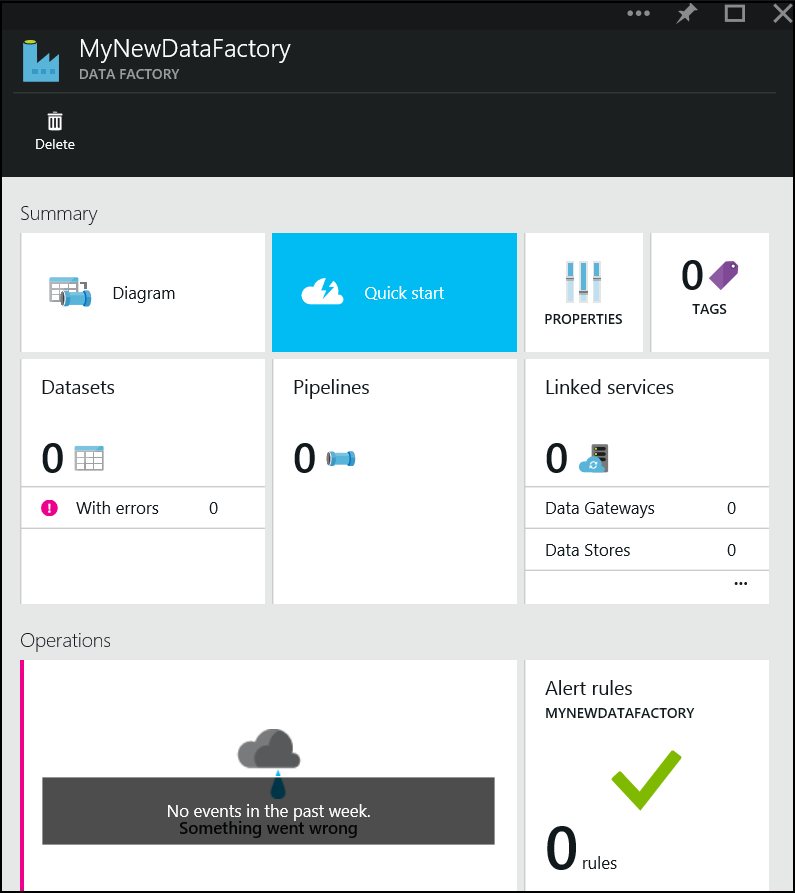
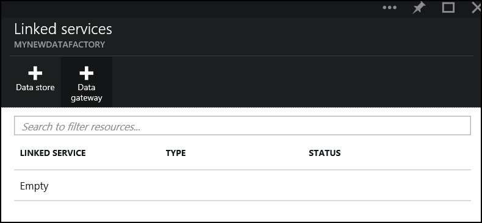
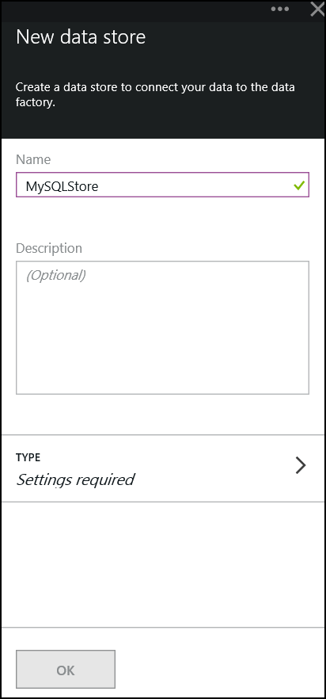
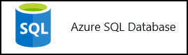
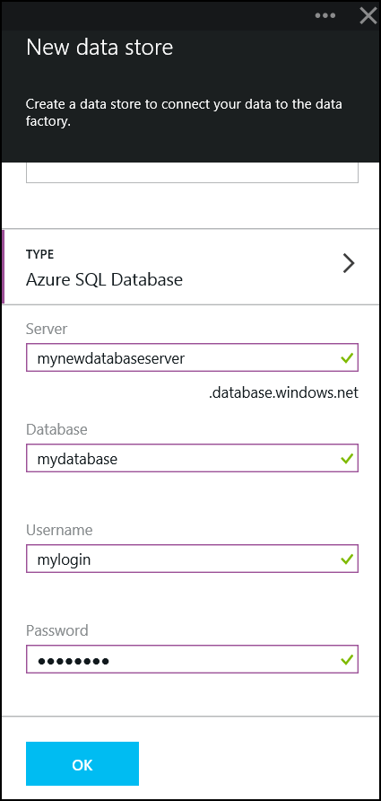
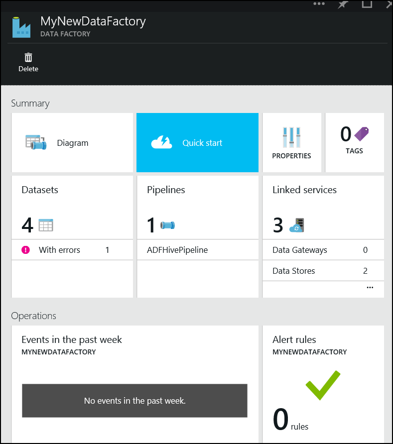
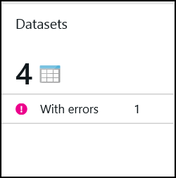
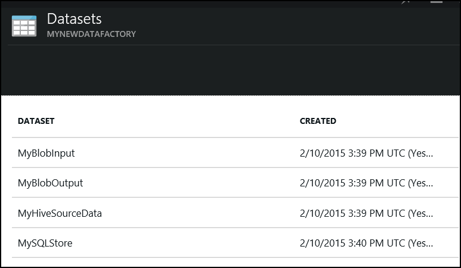
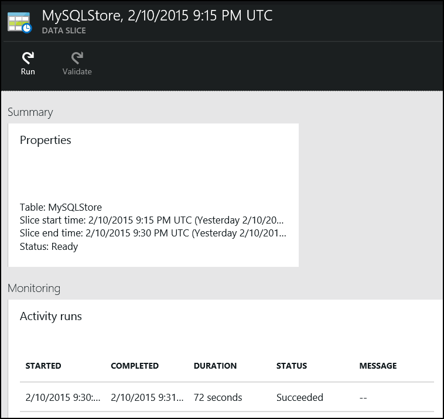

# Hands on Lab 8 - Azure Data Factory #

## Introduction ##

In this lab we will use Azure Data Factory to execute a Hive query using a pre-created HDInsight cluster.  We will push the query output to an Azure SQL Database.

## Pre-requisites ##

- A SQL Server insance has been created (HOL 1)
- The table readingsByMinute has been created (HOL 1)
- HBase cluster (created during lab HOL 2)

## Create a new Azure Data Factory ##

The Azure Data Factory service is a fully managed service for composing data storage, processing, and movement services into streamlined, scalable, and reliable data production pipelines. Developers can use Data Factory to transform semi-structured, unstructured and structured data from on-premises and cloud sources into trusted information. Developers build data-driven workflows (pipelines) that join, aggregate and transform data sourced from their on-premises, cloud-based and internet services, and set up complex data processing through simple JSON scripting. 

1. Navigate to [https://portal.azure.com/](https://portal.azure.com/) and sign with your Microsoft or Organizational account 
2. In the lower hand corner of the screen Click New -> Everything -> Data + Analytics -> Data Factory and select

	

3. Set the name and resource group for the data factory, currently the region is locked and cannot be changed. 

    

4.  Navigate to the data factory once it has been successfully created
 
    

5. We need to create a number of Linked Services that represent Azure Blob Storage and SQL Server instances we have previously created. To create new linked services click this area.

    

6. This will display the following blade

    

7. Click Add Data Store

    

8. Set a name for the data store "MyBlobStore"

	

9. Select Type button

    

10. This will open a new blade showing the set of available types

	

11. Choose Azure Storage

    

12.  Using the storage account assigned to the HDInsight cluster created earlier, set the Account Name/Key (these values can be found in the portal) and click Ok.

    

13. Add another data store, this will link to the SQL Server we created. 

    

14. When selecting the Type choose Azure SQL Server

	

15. Enter the connection information and click Ok.

    

## Configuring ADF ##

All subsequent work will be conducted using Powershell.  We need to create some additional objects

A set of objects have been pre-created that may need to be modified.  Primarily we need to update the references to the Data Stores we have just created.

1. Navigate to src/ADF
2. Open document MyBlobInput.json and update the value for property linkedServiceName to the name of the storage data store you created. Replace `mystoragecontainer` in `folderPath` with the container the cluster was created with.

	```json
	{
	    "name": "MyBlobInput",
	    "properties":
	    {
	        "location": 
	        {
	            "type": "AzureBlobLocation",
	            "folderPath": "mystoragecontainer/input",
	            "linkedServiceName": "MyBlobStore"
	        },
	        "availability": 
	        {
	            "frequency": "minute",
	            "interval": 15,
	            "waitonexternal": {}
	        }
	    }
	}
	```
3. Open MyBlobOutput.json and update the value for property linkedServiceName to the name of the storage data store you created.  Replace `mystoragecontainer` in `folderPath` with the container the cluster was created with.

	```json
	{
	    "name": "MyBlobOutput",
	    "properties":
	    {
	        "location": 
	        {
	            "type": "AzureBlobLocation",
	            "folderPath": "mystoragecontainer/output/myaverageByMinute",
	            "linkedServiceName": "MyBlobStore"
	        },
	        "availability": 
	        {
	            "frequency": "Minute",
	            "interval": 15
	        }
	    }
	}
	```

4. Open MyHiveSourceData.json and update the value for property linkedServiceName to the name of the storage data store you created.  Replace `mystoragecontainer` in `folderPath` with the container the cluster was created with.

	```json
	{
	    "name": "MyHiveSourceData",
	    "properties":
	    {
	        "structure": [
	            { "name": "DeviceType", "type": "String"},
	            { "name": "DateOfReading", "type": "String"},
	            { "name": "RoomNumber", "type": "String"},
	            { "name": "Reading", "type": "Decimal"}
	        ],
	        "location":
	        {
	            "type": "AzureBlobLocation",
	            "folderPath": "mystoragecontainer/output/myaverageByMinute",
	            "fileName": "000000_0",
	            "linkedServiceName": "MyBlobStore",
	            "format":
	            {
	                "type": "TextFormat",
	                "columnDelimiter": "\t"
	            }
	        },
	        "availability":
	        {
	            "frequency": "Minute",
	            "interval": 15,
	            "waitonexternal": {}
	        }
	    }
	}   
	```

5. Open and update the value for property linkedServiceName to the name of the SQL Server data store you created

	```json
	{
	    "name": "MySQLStore",
	    "properties":
	    {
	        "structure":
	        [
	            { "name": "DeviceType", "type": "String"},
	            { "name": "DateOfReading", "type": "String"},
	            { "name": "RoomNumber", "type": "String"},
	            { "name": "Reading", "type": "Decimal"}
	        ],
	        "location":
	        {
	            "type": "AzureSQLTableLocation",
	            "tableName": "readingsByMinute",
	            "linkedServiceName": "MySQLStore"
	        },
	        "availability": 
	        {
	            "frequency": "Minute",
	            "interval": 15            
	        }
	    }
	}
	```

6. Open MyHDInsightCluster.json, Modify ClusterUri to point to your cluster, the UserName/Password values are those you used during cluster creation.  Update the value for property linkedServiceName to the name of the storage data store you created  

	```json
	{
	    "Name": "MyHDInsightCluster",
	    "Properties": 
	    {
	        "Type": "HDInsightBYOCLinkedService",
	        "ClusterUri": "https://<clusterName>.azurehdinsight.net/",
	        "UserName": "<username>",
	        "Password": "<password>",
	        "LinkedServiceName": "MyBlobStore"
	    }
	}
	```

7.  You should not need to update ADFHivePipeline.json.  This object lined the various inputs/outputs/objects detailed above into a pipeline composed of activities.  Replace `mystoragecontainer` in `scriptpath` with the container the cluster was created with.
	
	```json
	{
	    "name": "ADFHivePipeline",
	    "properties":
	    {
	        "description" : "It runs a HiveQL query and stores the result set in a blob",
	        "activities":
	        [
	            {
	                "name": "RunHiveQuery",
	                "description": "Runs a hive query",
	                "type": "HDInsightActivity",
	                "inputs": [{"name": "MyBlobInput"}],
	                "outputs": [ {"name": "MyBlobOutput"} ],
	                "linkedServiceName": "MyHDInsightCluster",
	                "transformation":
	                {
	                    "type": "Hive",
	                    "scriptpath": "mystoragecontainer/scripts/queries.hql",
	                    "scriptLinkedService": "MyBlobStore"
	                },
	                "policy":
	                {
	                    "concurrency": 1,
	                    "executionPriorityOrder": "NewestFirst",
	                    "retry": 1,
	                    "timeout": "01:00:00"
	                }
	            },
	            {
	                "name": "CopyFromBlobToSQL",
	                "description": "Push data from Hive query to SQL database",
	                "type": "CopyActivity",
	                "inputs": [ {"name": "MyHiveSourceData"} ],
	                "outputs": [ {"name": "MySQLStore"} ],     
	                "transformation":
	                {
	                    "source":
	                    {                               
	                        "type": "BlobSource"
	                    },
	                    "sink":
	                    {
	                        "type": "SqlSink"
	                    }   
	                },
	                "Policy":
	                {
	                    "concurrency": 1,
	                    "executionPriorityOrder": "NewestFirst",
	                    "style": "StartOfInterval",
	                    "retry": 0,
	                    "timeout": "01:00:00"
	                }       
	            }
	        ]
	    }
	}
	```

## Deploying ADF Objects ##

1. Open Powershell, navigate to src/ADF directory
2. Execute the command to authenticate against Azure and ensure you are in the correct subscription.

	```
	Add-AzureAccount
	```

3. Execute the following command to switch modes

	```
	Switch-AzureMode AzureResourceManager
	```

4. The following commands will deploy the set of objects to the data factory.  Substitute ResourceGroupName and DataFactoryName as appropriate

	```
	New-AzureDataFactoryTable –ResourceGroupName <ResourceGroupName> –DataFactoryName <DataFactoryName> -File .\MyBlobInput.json
	New-AzureDataFactoryTable –ResourceGroupName <ResourceGroupName> –DataFactoryName <DataFactoryName> -File .\MyBlobOutput.json
	New-AzureDataFactoryTable –ResourceGroupName <ResourceGroupName> –DataFactoryName <DataFactoryName> -File .\MyHiveSourceData.json
	New-AzureDataFactoryTable –ResourceGroupName <ResourceGroupName> –DataFactoryName <DataFactoryName> -File .\MySQLStore.json
	New-AzureDataFactoryLinkedService -ResourceGroupName <ResourceGroupName> -DataFactoryName <DataFactoryName> -File .\MyHDInsightCluster.json
	New-AzureDataFactoryPipeline –ResourceGroupName <ResourceGroupName> –DataFactoryName <DataFactoryName> –File .\ADFHivePipeline.json
	```

5. Set the execution bounds using the command below, this will define the start time/end time of execution of the pipeline.  Modify the start/end date string so it starts approximately 5 mins in the future.  Note this pipline will be processed every 15 minutes as defined in the availability section of the various inputs/outputs. 

	```
	Set-AzureDataFactoryPipelineActivePeriod -ResourceGroupName MyNewResourceGroup -DataFactoryName mynewdatafactory -StartDateTime 2015-02-10T16:00:00Z –EndDateTime 2015-02-10T21:30:00Z –Name ADFHivePipeline
	```

## Troubleshooting ##

You view the progress of the pipeline in the portal.  

1. Navigate to the data factory in the portal

    

2. Choose option Data Sets
 
    

4. These objects equate to the inputs/outputs to the pipeline, select MySQLStore 

    

5. This will display a blade that shows successful and unsuccessful runs.  

    

6. Clicking on a successful run will display the following blade, this provides additional information on the run.

    

7. Click the individual run details

    

8. This will open an additional blade with will show any logs.  

    

9. For instance we can choose a failed run

    

10. We can get the details.

    

11. And get the log to help diagnose the issue.

    

12. We can do the above with any of the Data Sets we created.