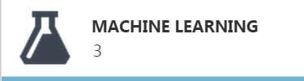
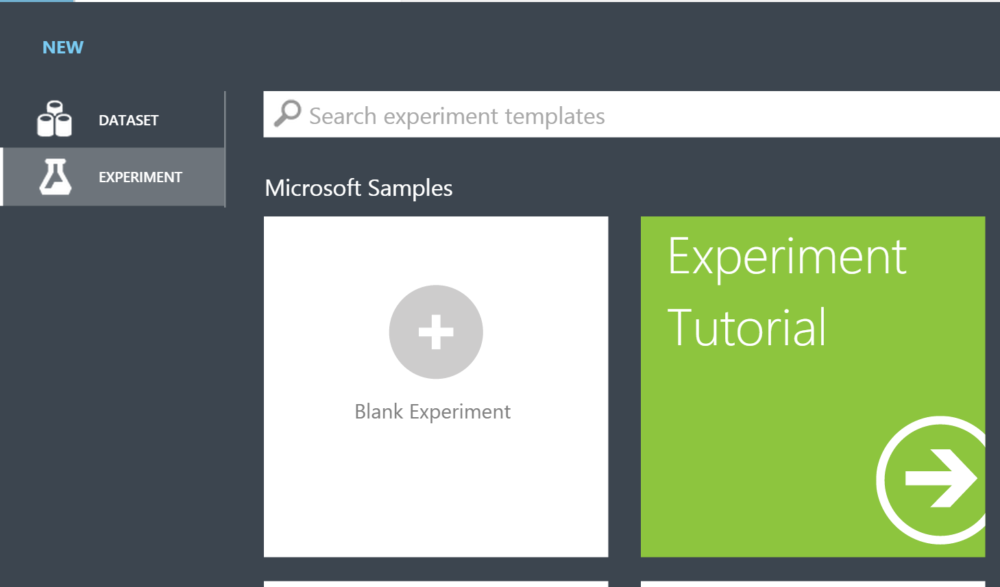
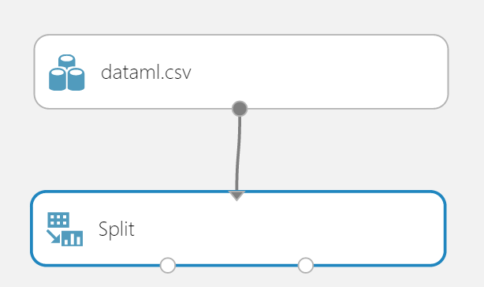
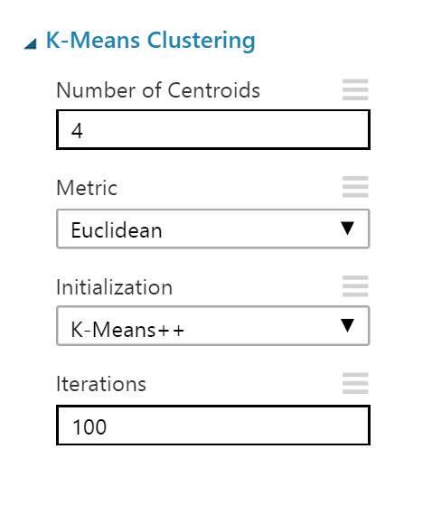
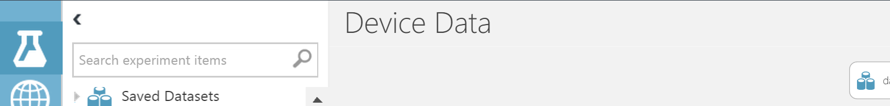
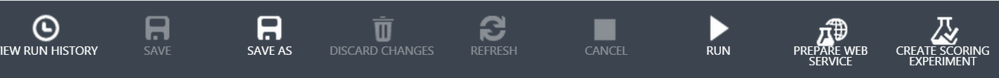
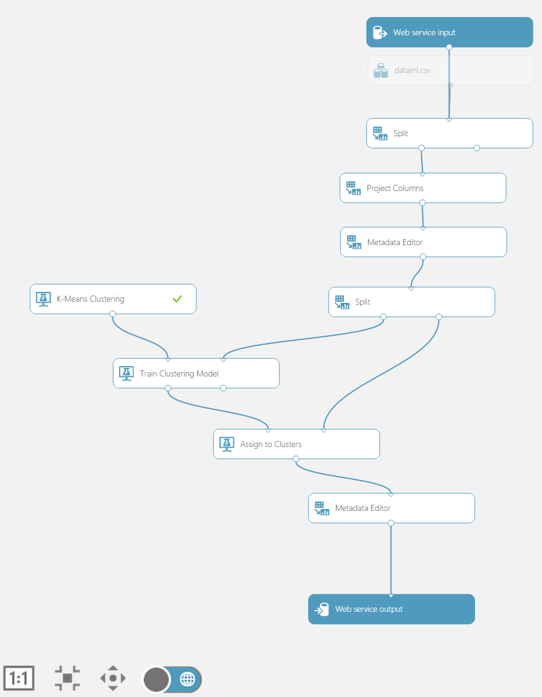
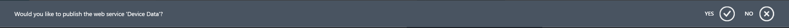
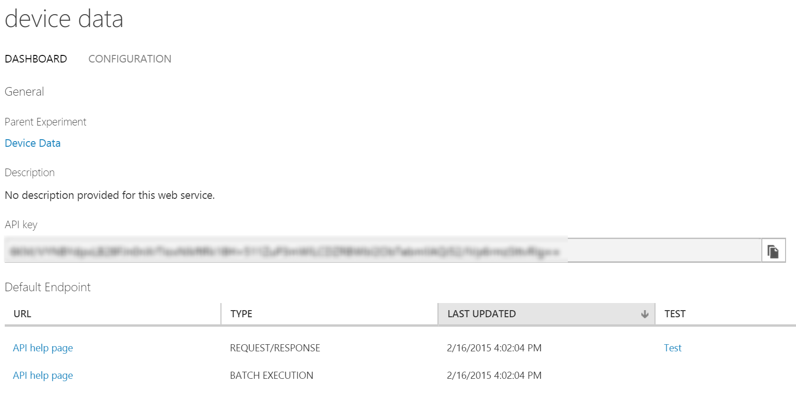
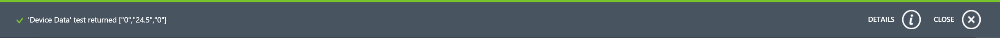

# Hands on Lab 10 - Introduction to AzureML and Machine Learning #

Overall time to complete: **20 minutes**

Prerequisites: **A valid Azure subscription and a valid Microsoft or Organizational that is able to access the subscription as a Service Administrator**

# 1. Creating an AzureML namespace #

1. 	Sign-in to the Microsoft Azure portal at [http://manage.windowsazure.com](http://manage.windowsazure.com). (NOTE: AzureML is only available in current Management Portal at this time).

	 

2. 	Ensure that you have enabled Machine Learning as a Preview Feature. To do this you can select Machine Learning from the list of preview features from this page. [http://azure.microsoft.com/en-gb/services/preview/](http://azure.microsoft.com/en-gb/services/preview/)

3. 	When you’ve been informed that Machine Learning is available to you (you'll receive an email) it should be visible in the Azure Portal.

	

4.	Click on the +NEW button in the left hand corner of the screen to create a new AzureML workspace.

	 

5.	Provide a valid name for the AzureML workspace and provide a valid workspace owner. This will usually default to the Microsoft Account that you have used to access the Azure portal with. During the preview you should note that AzureML is only available in South Central US. Enter a storage account name which exists already in South Central US or elect to create a new account, with a unique name, in this region.

	 

6. 	Click on the CREATE AN ML WORKSPACE link to create the new AzureML workspace.  The new AzureML workspace will be available in about 2-3 minutes.

7. 	You should receive an email as the workspace owner welcoming you to AzureML.  The new workspace will be listed in the portal.

	 

	
# 2. Upload a new dataset #

1. 	Click on the “Open in Studio” button on the bottom taskbar of your AzureML namespace. This will open up a second browser tab which will contain MLStudio.

	

2. 	Navigate to the new tab and at the bottom left hand corner of the screen you should see the now familiar "+NEW" button. Click this button.
 
	 

3. 	Select DATASET -> "From Local File" from the new dialogue.

	

4. 	A new dialogue will be presented to you. From this, select "Choose File" and  navigate to the course root directory -> assets -> dataml.csv.

	

5. 	In the "ENTER A NAME FOR THE NEW DATASET" textbox enter Device Data. Leave everything else as you see it and click the tick mark in the right hand corner of the dialogue. 

# 3. Create an experiment #

1. 	Click on the +NEW button in the bottom left corner of the screen and select Experiment -> Blank Experiment. 

	

2. 	The menu shows all of the top level options in AzureML.

	

3. 	Open the "Saved Datasets" node and drag the newly uploaded **Device Data** on to the canvas on the right-hand side.

4. 	Navigate to "Data Transformation" -> "Sample and Split" and drag the **Split** task to the canvas and position underneath the the dataset **Device Data**.

	

5. 	Connect the output port of the **Device Data** dataset and drag to the input port of the **Split** task to connect the items. 

6. 	Click on the **Split** task and in the right hand properties Splitting Mode dialogue select **regular expression** from the splitting mode dropdown. Then add **\"type" ^temperature** into the regular expression textbox.

6. 	We'll now select the **Project Columns** task from "Data Transformation" -> Manipulation. This module allows us to select which columns of data we want to include or exclude in the model. After we've dragged this onto the canvas select the Split task left output port and drag to the Project Columns input port.  

7. 	Click on the Project Columns task and press the **Launch column selector** button in the properties window. In the properties textbox we'll enter **reading** and **roomno** (two of the columns in the dataset).  Click the check mark in the lower right corner to accept the changes and close the column selector.

	

8. 	From "Data Transformation" -> Manipulation drag the **Metadata Editor** task onto the canvas.  Connect the Project Columns task to the Metadata Editor task.  

9. 	Click on the *Metadata Editor** task in the design pane.  Notice the **Quick Help** in the lower right corner of the Azure ML Studio.  When you click the **(more help)** link a new browser tab opens with a detailed description of the task and options.  After reviewing the description and options, return to the Azure ML studio.

10. To edit the properties of the Metadata Editor, select the **Launch column selector** and enter reading and roomno. 

11. Update each of the following properties:

	- 	Data Type: Floating Point
	- 	Categorical: Make non-categorical		
	- 	Fields: Features

	

12. Drag a second split task to the design pane and connect to the Metadata Editor. This time leave the splitting mode to the default "split rows" but the change the value in the textbox underneath "fraction of values in the rows first" from 0.5 to 0.8.

13. By now we should have the following on our canvas configured correctly

	

14. We're now ready to consider our machine learning algorithm so we'll drag three tasks onto the screen.  Position and connect them as in the diagram below and in the correct list order.

	-	"Machine Learning" -> "Initialize Model" -> Clustering -> K-Means Clustering
	-	"Machine Learning" -> Train -> Train Clustering Model
	-	"Machine Learning" -> Score -> Assign to Clusters 

	

15. Click on the K-Means Clustering task and update the properties page on the right-hand side. Change the value for **Number of Centroids** to 4 but keep all other values the same.

	

16. Click on the **Train Clustering Model** task and launch the column selector to select **reading** and **roomno**.  Repeat for the **Assign to Clusters** task. 

17. Now we've completed the steps we can drag another "Data Transformation" -> Manipulation -> "Metadata Editor" task to the canvas and connect the *Assign to Clusters** output port to the new **Metadata Editor** input port.  In the properties page select **Launch column selector**, but this time choose a new column called "Assignments" and from the Categorical dropdown select "Make Categorical". 

18. We can now rename the experiment to something sensible. This is done by clicking on the top of the experiment and typing in a new name. In this case we'll call the experiment "Device Data".

	

19. We'll now click on the Save button on the bottom toolbar followed by the Run button.

	

20. After running the experiment you'll see all of the tasks with a green tick in the corner.

	

21. Right-click at the bottom of "Assign to Clusters" (on the small circle) and select **Visualize** to see a graph of the principal components.

	

22. Right-click at the bottom of the final "Metadata Editor" task and select Visualize to see a table of all of the temperature device data and the cluster assignment (0-3) of each data point

	

n.b. The algorithm has been able to spot a number of skewed results which represent less than average or greater than average temperature readings in clusters 1-3  
	
# 4. Enable access to a web service #

1. 	Now that experiment is complete we can open up our model to the rest of the world! In order to do we'll click on the "Prepare Web Service" button on the bottom toolbar

	

2. 	Clicking the button will do the following:

	-	Introduce a task at the top of the workflow called "Web service input"
	-	Introduce a task at the bottom of the workflow called "Web service output"
	-	Introduce a new "switch" which toggles between the "web services view" and the "training experiment view"

3. We should now be defaulted to the web services view

	

4. 	We'll now move the web service connection from top directly to the "Assign to Clusters" task. 

	

5. Run the experiment again, note that the "Prepare web service" button on the bottom toolbar has now changed to "Publish web service"
6. 	When the confirm dialogue appears click yes

	

7. 	When this operation has completed another browser tab will open containing all of the details about the new web service and how to access it 

	
	  
# 5. Test the web service #

1. 	On the results page you should be able to see a small link which says "test"  next to the REQUEST/RESPONSE "Api help page" link. Click on this link to test the service

2. 	Enter a roomno and reading in the dialogue e.g. 0 and 24.5

	

3. 	The task bar at the bottom should show the result

	

4. 	The result is returned JSON and should look something like this ["0", "24.5", "0"], where the first two arguments of the JSON array are roomno and reading and the final argument is the cluster 0 (remember clusters 0-3 from the previous step) which tells us that this data point is within the average set of data points 

5. 	For completeness, you can click on the "API help page" link from the page in step (1) and navigate to the bottom of the page. Here you will see code in C#, R or Python which can be used to invoke the web service programmatically from frameworks such as Storm or from virtual machines in Azure 
