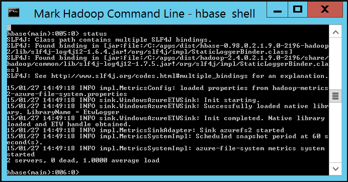

# Hands on Lab 6 - Create and Query HBase Tables #

**Pre-Requisites**
A Hbase Cluster has been created using PowerShell script [HOL5-CreateHBaseClusterPowershell.md](HOL5-CreateHBaseClusterPowershell.md)

# 1. Overview #

In this lab we will use two methods to create, populate and query HBase tables.  The HBase shell is a simple command line tool to issue statements to create tables, and put and get data from the tables.  HIVE is a SQL framework to use SQL syntax to manage tables and data in HBase.  

The lab will demonstrate a data movement process to insert single values and to populate tables with aggregated data for analysis.  

# 2. Introduction to HBase #

HBase is an Apache open source NoSQL database built on Hadoop that provides random access and strong consistency for large amounts of unstructured and semi-structured data.  Data is stored in the rows of a table and data within a row is grouped by column family. HBase is a schema-less database in the sense that neither the columns nor the type of data stored in them need to defined before using them. It scales linearly to handle petabytes of data on thousands of nodes. It can rely on the data redundancy, batch processing and other features that are provided by distributed applications in the Hadoop ecosystem.

# 3. Interacting with HBase with the HBase Shell  #

Creating and querying HBase tables is supported through multiple methods.  This lab will demonstrate how to create and query tables with the HBase shell through the command line.  

## 3.1	Enable Remote Desktop and Connect to the HBase Head Node ##
1.	Navigate to the Microsoft Azure management interface [https://manage.windowsazure.com](https://manage.windowsazure.com) (NOTE: RDP an only be configured through the management interface at this time)
2.	Select HDInsight from the left menu and click on the HBase cluster created in the previous Hand on Lab. 
3.	Select "configuration" from the top menu and select  Enable Remote from the bottom of the page.
4.	RDP will require a new username unique to the cluster. Enter a new username and password.  **Ensure the username differs from the one chosen at cluster creation.** Select an expiration date for RDP.  NOTE: The expiration date must be in the future and no more than a week from the present. The expiration time of day is assumed by default to be midnight of the specified date. Click Ok to configure RDP, this will take 2-3 minutes to complete.

	

5. 	Once configuration is complete initiate the RDP connection using the Connection button located at the bottom of the screen.  Follow the steps to connect to the HBase head node.


## 3.2	Interacting with HBase through the Command Line ##

This section will demonstrate some simple HBase shell commands to interact with HBase and the tables.  The commands for this section are available on the course virtual machine under **C:\CloudDataCamp\Scripts\HBase\2_HBase Shell Commands.txt**.  

1.	Open the Hadoop Command Line Interface from the desktop of the head node. 

2.	Enter the following to launch the HBase shell.

	```
	cd %hbase_home%\bin
	hbase shell
	```

3.	Execute command "Status".  The following should be printed

	

4.	Enter the following to create a table named "kinecttelemetry" with two column families named "interaction" and "demographics".  The **list** command will return the list of tables with the name "kinecttelemetry".

	```
	create 'kinecttelemetry', 'interaction', 'demographics'
	list 'kinecttelemetry'
	```
	
5. 	Enter the following commands to put, or insert, a single row with an ID of 721.  The row will have three columns in the column family "interaction".  Note the syntax for the column: **[column family]:[column name], [column value]**

	```
	put 'kinecttelemetry', '721', 'interaction:action', 'removed'
	put 'kinecttelemetry', '721', 'interaction:duration', '50'
	put 'kinecttelemetry', '721', 'demographics:age', '45'
	```
	
6.	The **scan** command will return the values in the table.

	```
	scan 'kinecttelemetry'
	```
	
7. 	Enter the following to put another row in the table. Note that this row includes a column in two different column families.

	```
	put 'kinecttelemetry', '720', 'interaction:duration', '100'
	put 'kinecttelemetry', '720', 'demographics:gender', 'male' 
	```

8.	The **get** command will return a single row, or a single column in a single row.

	```
	get 'kinecttelemetry', '720'
	get 'kinecttelemetry', '720', 'demographics:gender'
	get 'kinecttelemetry', '721'
	```
	
9. 	Before a table can be dropped, the table must be disabled.  Enter the following commands to disable the table and drop the table. 

	```
	disable 'kinecttelemetry'
	drop 'kinecttelemetry' 
	```

10.	Before we move to another method of interacting with HBase, enter the following commands to create the "readings" table that will be used throughout the course. Issue the **list** comnmand to verify the table was created. A copy of this statement is available on the course virtual machine at **C:\CloudDataCamp\Script\HBase\3_Create readings table.txt**.
	
	```
	create 'readings', 'count', 'sum', 'average'
	list 'readings'
	```

11.	Close the remote desktop session with the HBase head node and return to the main desktop for the course.

This section demonstrated:
	- Connecting to the HBase shell on the HBase head node
	- Creating a simple table with two column families
	- Issuing put statements to insert rows and columns
	- Scanning an HBase table
	- Returning single row and column values with the get statement
	- Dropping a table

At the end of this section you should have a single table in HBase which will be used in subsequent labs.  


## 3.3 Interacting with HBase through Hive ##

Hive is a familiar tool in Haddop to interact with data using a familiar SQL syntax.  Hive is also available for use with HBase.  This section will demonstrate using Hive over HBase to create, populate and query HBase tables.

Data should exist in the data container under the **input** directory from the previous lab.  The data has been pre-formatted into a CSV. If the data is not present in the **data** container, return to the AZCopy section in Hand on Lab 2 to load the data. 

1. 	The HDInsight cluster provides a web based interface to execute Hive queries.  Navigate to the HDInsight web interface located at **https://\<clustername\>.azurehdinsight.net//**

2. 	Enter the credentials initially used when creating the HDInsight HBase cluster. 

	 

3. 	The **Getting Started Gallery** is a launching point for samples and common data analysis solutions.  Click on **Hive Editor** from the top menu to launch a query editor.  

	

4. 	The Hive Editor accepts queries to issue DML and DDL statements that manage and query tables in Hadoop.  The next section will walk through creating tables, populating tables, and issuing simple HQL statements to query the tables. 

	


#### Create the source table ####

We need to associate the source data with a Hive table.  The following creates an External table and links the data stored in the location to the table.  

5. 	Enter the following hive query to the editor window to create the base table over the raw detail data.  A copy of this statement is stored on the course virtual machine at **C:\CloudDataCamp\Scripts\HBase\4_Create DeviceReadings.txt**.  Note that you'll need to update the last line in query and replace **\<storage account name>** with the storage account you created in Hands on Lab 1.

	```SQL
	DROP TABLE IF EXISTS DeviceReadings;

	CREATE EXTERNAL TABLE DeviceReadings (
		type string, sensorDateTime string, deviceId string, roomNumber int, reading float
	)
	ROW FORMAT DELIMITED FIELDS TERMINATED BY '\054'
        STORED AS TEXTFILE
        LOCATION 'wasb://data@<storage account name>.blob.core.windows.net/input';
	```

6. 	Click the Submit in the lower right of the console.

 	

7. 	After a short delay a new Job will appear in the Job Session section at the bottom of the console. 

 	

8. 	Wait for the job to complete.  Click the **View Details** link to open a new tab in the browser with the detailed history of the job execution.  

 	


#### Average Reading By Minute Table ####

The AverageReadingByMinute table aggregates the average reading value for each device by minute.  Note how the table uses a composite key column when inserting records into hbase.  Each HBase table row must be uniquely identified by a single key value, and it is common to concatonate values to develop composite keys. 

9. 	Enter the following hive query to the editor window.  A copy of this statement is stored on the course virtual machine at **C:\CloudDataCamp\Scripts\HBase\5_AverageReadingByMinute.txt**. 

	```SQL
    DROP TABLE IF EXISTS AverageReadingByMinute;

	CREATE TABLE AverageReadingByMinute (key string, type string, sensorDateTime string, roomNumber int, reading float);

    INSERT INTO TABLE AverageReadingByMinute SELECT concat(type, "_", deviceId, "_", roomNumber, "_", substr(sensorDateTime, 1, 16), ":00.0000000Z") as key, type, concat(substr(sensorDateTime, 1, 16), ":00.0000000Z") as dateTime, roomNumber, avg(reading) 
       FROM DeviceReadings 
       WHERE roomNumber IS NOT NULL 
       GROUP BY concat(type, "_", deviceId, "_", roomNumber, "_", substr(sensorDateTime, 1, 16), ":00.0000000Z"), type, concat(substr(sensorDateTime, 1, 16), ":00.0000000Z"), roomNumber;
	```

10. Click the Submit button to execute the query and wait for the job to complete.

#### HBase Device Readings Table ####

11. Enter the following hive query to the editor window.  A copy of this statement is stored on the course virtual machine at **C:\CloudDataCamp\Scripts\HBase\6_HBaseDeviceReadings.txt**. 

	```SQL
    DROP TABLE IF EXISTS HBaseDeviceReadings;

    CREATE TABLE HBaseDeviceReadings(key string, type string, sensorDateTime string, roomNumber int, reading float) 
        STORED BY 'org.apache.hadoop.hive.hbase.HBaseStorageHandler'
        WITH SERDEPROPERTIES ("hbase.columns.mapping" = ":key,type:val,sensorDateTime:val,roomNumber:val,reading:val")
        TBLPROPERTIES ("hbase.table.name" = "HBaseDeviceReadings");

    INSERT OVERWRITE TABLE HBaseDeviceReadings SELECT * FROM AverageReadingByMinute;
	```

12. Click the Submit button to execute the query and wait for the job to complete.

#### Querying HBase Tables ####

You can query the HBase table as you would a Hive table.  

13. Execute a query i.e. 

	```SQL
	SELECT * FROM HBaseDeviceReadings;
	SELECT * FROM HBaseDeviceReadings where key='energy_energy20_0_2015-01-21T16:46:00.0000000Z'
	SELECT * FROM HBaseDeviceReadings where roomNumber = 0;
	```

14. When the job is complete, navigate to the job result page and scroll to the **Job Output** section.  


