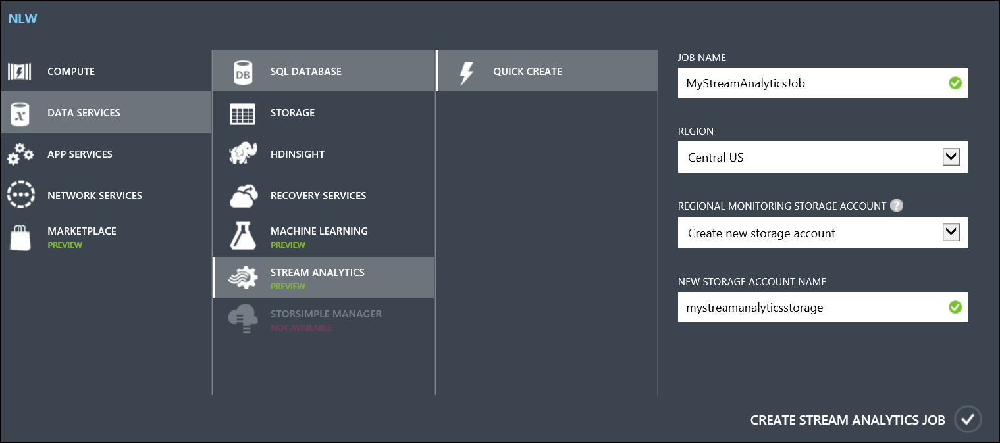
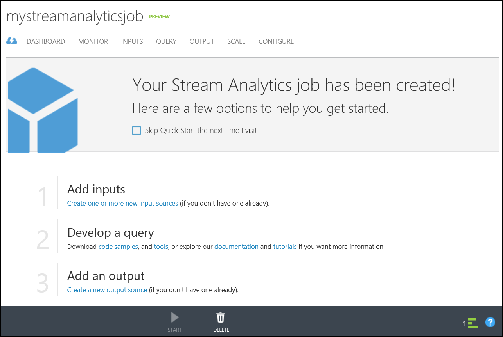
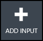
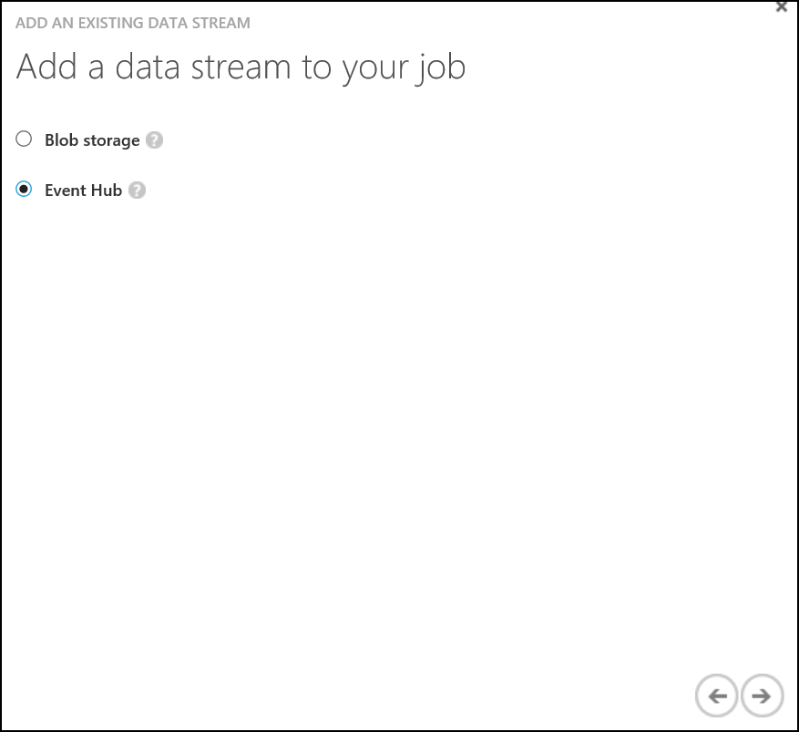
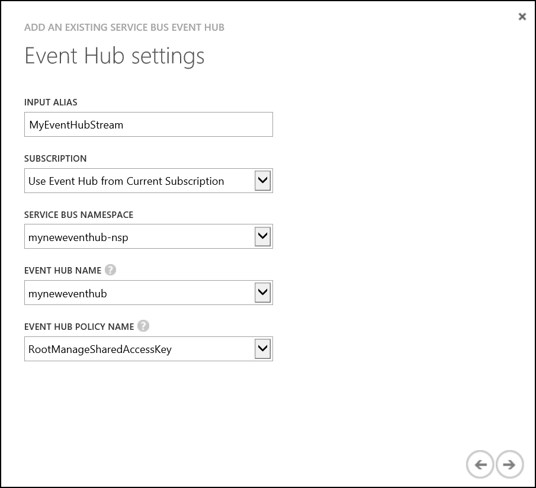
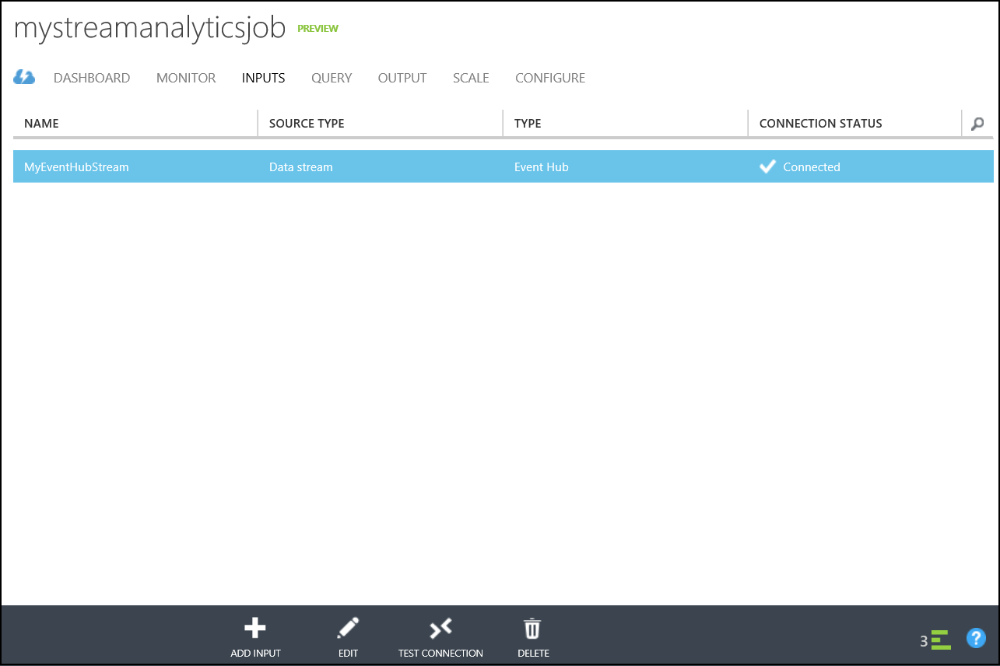
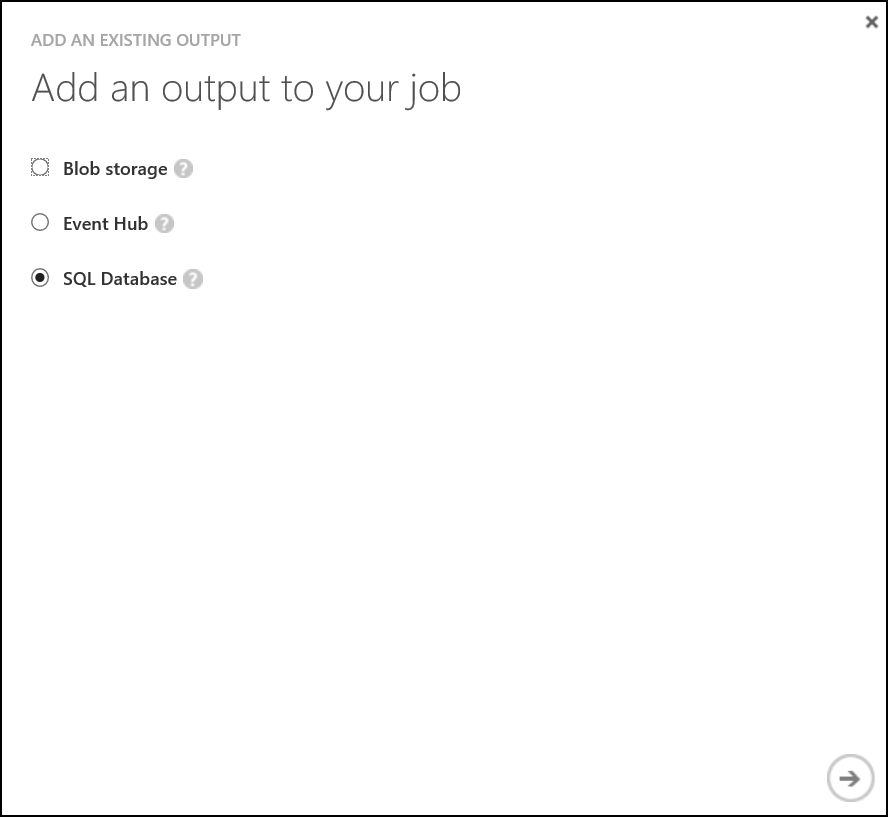
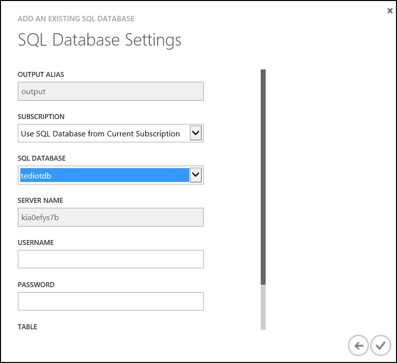

# Hands on Lab 9 - Azure Stream Analytics #

## 1. Introduction ##

In this lab we will use Azure Stream Analytics and a tumbling window to aggregate device data and output this to a Azure SQL Database

## 2. Pre-requisites ##

- Database table created as part of HOL 1

## 3. Create the Streaming Analytics Job ##

1.  Navigate to the Microsoft Azure management interface [https://manage.windowsazure.com](https://manage.windowsazure.com) (NOTE: Azure Stream Analytics is only configurable in current Management Portal at this time)

2. Click "+NEW" in the bottom left hand corner of the screen

	

3. Select Data Services -> Stream Analytics, click Quick Create.

	

4. Configure Stream Analytics.
	- Enter a job name and location (limited choice due to this being in preview, select any location)
	- Select **Create new storage account**.
	- Enter a new storage account name.
	
5. Click Create stream analytics job.

	

6. Once creation has finished, navigate to the job.

	

7. Select the Inputs tab.

    

8. Click "+Add Input" at the bottom middle of the screen.

	

9. Choose the default "Data stream" click next.

    

10. Choose the "Event Hub" option.

    

11. Enter the connection information for the event hub, click next.
	- Input alias is **MyEventHubStream** (The name is important as it is references in the query)
	- Select **Use Event Hub from Current Subscription**

    

12. Specify that the data serialization format is JSON and the encoding is UTF-8, click Finish

	

13. The connection to the storage account will be tested, this will take a moment to complete

    

14. A new input will be created.

	

15. Navigate to the Output tab
 
    

16. Click "+Input" at the bottom middle of the screen

	

17. Choose SQL Database

    

18. Enter the connection information, click Finish.
	- Choose **Use SQL Database from Existing Subscription**
	- Select the database created in Hands on Lab 1
	- Enter the user name and password used when the database was created
	- Enter the table name **AvgReadings**
	
    

19. A new output will be created.

	

20. On the Query tab enter the following and select **Save** at the bottom.

	```SQL
	SELECT DateAdd(minute,-1,System.TimeStamp) as WinStartTime, system.TimeStamp as WinEndTime, Type = 'Temperature', RoomNumber, Avg(Temperature) as AvgReading, Count(*) as EventCount
    	FROM MyEventHubStream
    	Where Temperature IS NOT NULL
    	GROUP BY TumblingWindow(minute, 1), RoomNumber, Type
	UNION
	SELECT DateAdd(minute,-1,System.TimeStamp) as WinStartTime, system.TimeStamp as WinEndTime, Type = 'Humidity', RoomNumber, Avg(Humidity) as AvgReading, Count(*) as EventCount
	    FROM MyEventHubStream
	    Where Humidity IS NOT NULL
	    GROUP BY TumblingWindow(minute, 1), RoomNumber, Type
	UNION
	SELECT DateAdd(minute,-1,System.TimeStamp) as WinStartTime, system.TimeStamp as WinEndTime, Type = 'Energy', RoomNumber, Avg(Kwh) as AvgReading, Count(*) as EventCount
	    FROM MyEventHubStream
	    Where Kwh IS NOT NULL
	    GROUP BY TumblingWindow(minute, 1), RoomNumber, Type
	UNION
	SELECT DateAdd(minute,-1,System.TimeStamp) as WinStartTime, system.TimeStamp as WinEndTime, Type = 'Light', RoomNumber, Avg(Lumens) as AvgReading, Count(*) as EventCount
	    FROM MyEventHubStream
	    Where Lumens IS NOT NULL
	    GROUP BY TumblingWindow(minute, 1), RoomNumber, Type
    ```
    
21. On the Dashboard tab, start the job by pressing the "Start" button on the bottom middle of the page    

    

22. It will take a few moments to start, a minute or so later data should appear in the database table.  Use Microsoft SQL Management Studio to view the result.

	
